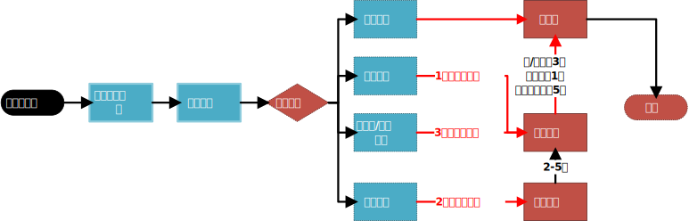
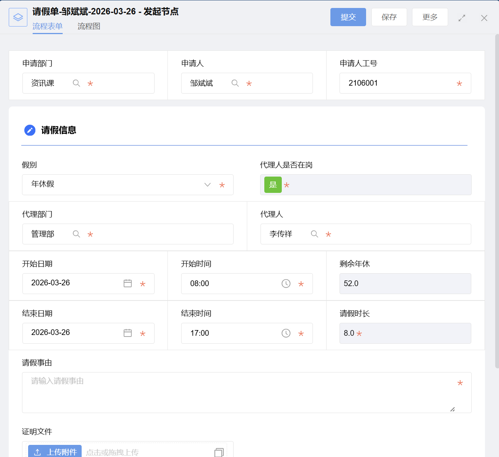

## 流程

## 表单说明

::: caution 注意
红色荧光为必填
:::

- ==申请部门=={.caution}： 会自动带出使用本帐号人员
- ==申请人=={.caution}：会自动带出使用本帐号人员
- ==申请人工号=={.caution}：会自动带出使用本帐号人员
- ==代理部门=={.caution}：默认上级
- ==代理人=={.caution}：默认上级
- ==代理人是否在岗=={.caution}：自带会筛选代理人是否请假。如果代理人请假不允许代理。
- ==假别=={.caution}：默认年休
- ==开始日期=={.caution}：默认当天
- ==开始时间=={.caution}：默认早上8：00
- ==结束日期=={.caution}：默认当天
- ==结束时间=={.caution}：默认晚上17：00
- ==剩余年休=={.caution}：默认系统带出
- ==请假时长=={.caution}：默认计算开始结束时间
- ==请假事由=={.caution}：请务必填写
- ==证明文件=={.caution}：相关假，必填写。

## 相关信息：

