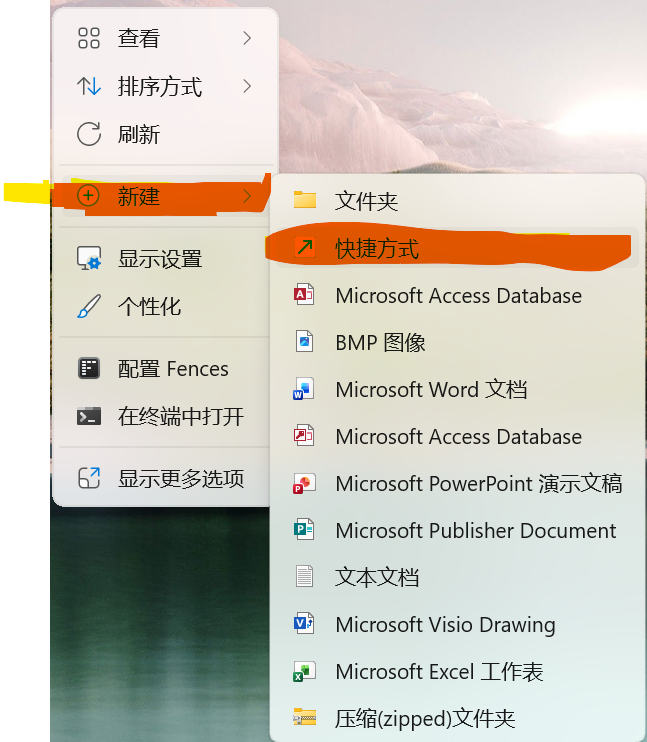
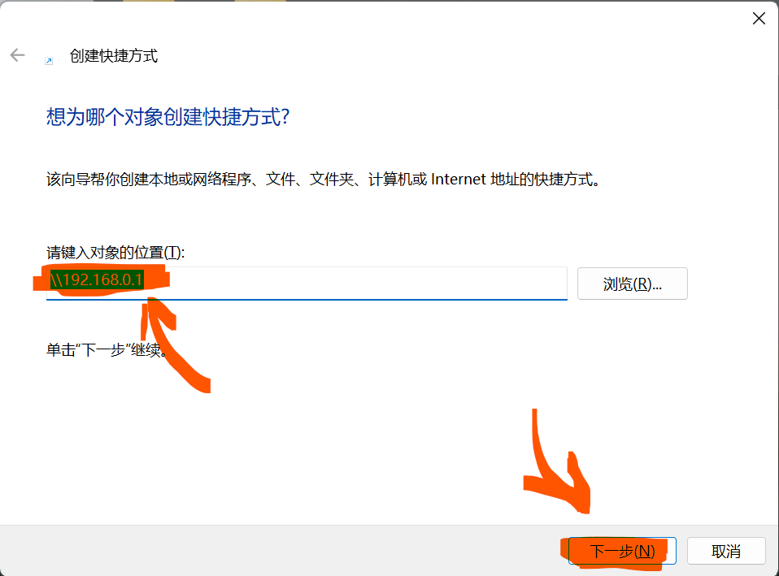
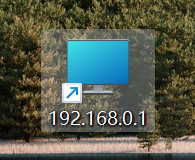
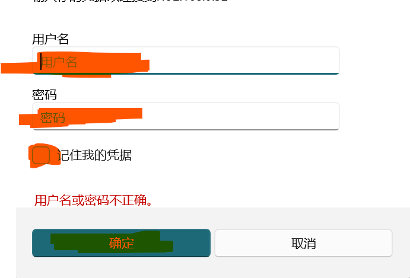

## 登录管理
::: steps
1. 右键点击桌面空白处，点击`新建`、再点击`快捷方式`。

2. 在如下页面在输入`\\192.168.0.1` 并点击下一步。

3. 点击完成 桌面出现下图快捷方式，并打开。

4. 输入帐号和密码，如果无法登录，需要在账号前面填写 ==`gauchen0\账号`==

:::
::: danger
   密码规范：`字母`、`数字`、`符号` 必须包含两种.!!!

:::

## 权限申请：

 - **申请表单 `file://192.168.0.1/资讯共享/4.申请表单/QR120101網路申請表.doc` 复制到文件夹地址栏。**

## 权限管理

:::table
|          服务器地址           |    文件夹名称    |       需要审批       |     备注     |
|:------------------------:|:-----------:|:----------------:|:----------:|
| \\192.168.0.1  | Accounting {.danger}  |     财务经理及以上 {.warning}     | 其它部门经总经理批准  |
|      \\192.168.0.1       |    caiwu   {.danger}  |     财务经理及以上 {.warning}     | 其它部门经总经理批准  |
|      \\192.168.0.1       |     cc    {.danger}   |     财务经理及以上 {.warning}    | 其它部门经总经理批准  |
|      \\192.168.0.1       |     pic    {.danger}  |      财务经理及以上  {.warning}    | 其它部门经总经理批准  |
|      \\192.168.0.1       |   public   {.success} |      所有人可用       |            |
|      \\192.168.0.1       |     qc  {.danger}     |      需孔经理同意   {.warning}   | 其它部门经总经理批准  |
|      \\192.168.0.1       |     财务   {.danger}    |      财务经理及以上   {.warning}   | 其它部门经总经理批准  |
|      \\192.168.0.1       |     财务部   {.success}  |   财务经理及以上  {.warning}  | 其它部门经总经理批准  |
|      \\192.168.0.1       |     工务部  {.success}   |    工务部经副理以上   {.warning} | 其它部门经总经理批准  |
|      \\192.168.0.1       |     关务    {.danger}   |    财务经理和以上同意  {.warning}  | 其它部门经总经理批准  |
|      \\192.168.0.1       |     管理部   {.success}  |   管理部经副理以上同意 {.warning}   | 其它部门经总经理批准  |
|      \\192.168.0.1       |    会议资料    {.danger}  |      总经理 {.danger}     | 其它部门经总经理批准  |
|      \\192.168.0.1       |    旧图留档   {.danger}   |    研发部经副理和以上  {.warning}   | 其它部门经总经理批准  |
|      \\192.168.0.1       |     量产图    {.danger}  |    研发部主管审批，其它部门经总经理批准   {.warning}  | 其它部门经总经理批准  |
|      \\192.168.0.1       |     品保部   {.success}  |     品保部经理、副理 其它部门经总经理批准 {.warning} | 其它部门经总经理批准  |
|      \\192.168.0.1       |     人事   {.danger}    |   人事主管、管理部主管、财务经理共同审批 {.warning}  | 其它部门经总经理批准  |
|      \\192.168.0.1       |     研发部   {.success}  | 除研发需总经理和研发最高主管同意其它部门经总经理批准{.warning} | 其它部门经总经理批准  |
|      \\192.168.0.1       |    研发部专案  {.danger}   | 除研发需总经理和研发最高主管同意 其它部门经总经理批准{.warning}| 其它部门经总经理批准  |
|      \\192.168.0.1       |     营销部   {.success}  |     营销部经副理以上  其它部门经总经理批准 {.warning}  | 其它部门经总经理批准  |
|      \\192.168.0.1       |    展华专案  {.danger}    |     财务经理和以上  其它部门经总经理批准 {.warning}   | 其它部门经总经理批准  |
|      \\192.168.0.1       |     制造部  {.success}   |     制造部经副理以上 其它部门经总经理批准 {.warning}   | 其它部门经总经理批准  |
|      \\192.168.0.1       |     资材部  {.success}   |     资材部经副理以上 其它部门经总经理批准  {.warning}  | 其它部门经总经理批准  |
|      \\192.168.0.1       |    资讯共享   {.success}  |      所有人只读  {.danger}   | 禁止申请权限  |
|      \\192.168.0.1       |    自动化专案 {.danger}    |    研发部经副理和以上  {.warning}   | 其它部门经总经理批准  |
|      \\192.168.0.1       |     总经理  {.danger}   |      总经理及以上   {.danger}    | 其它部门经总经理批准  |
  :::
